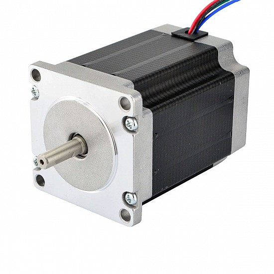

## Electrical Specification

  * Manufacturer Part Number: 23HS30-2804S
  * Motor Type: Bipolar Stepper
  * Step Angle: 1.8deg
  * Holding Torque: 1.9Nm(269.06oz.in)
  * Rated Current/phase: 2.8A
  * Phase Resistance: 1.13ohms
  * Inductance: 5.4mH±20%(1KHz)

## hysical Specification

  *  Frame Size: 57 x 57mm
  *  Body Length: 76mm
  *  Shaft Diameter: Φ6.35mm
  *  Shaft Length: 21mm
  *  D-cut Length: 15mm
  *  Number of Leads: 4
  *  Lead Length: 500mm
  *  Weight: 1.2kg

### Resources

  * Cad Drawing: [23HS30-2804S.STEP](../CAD/23HS30-2804S.STEP)
  * Full Datasheet: [23HS30-2804S.pdf](../PDF/23HS30-2804S.pdf)