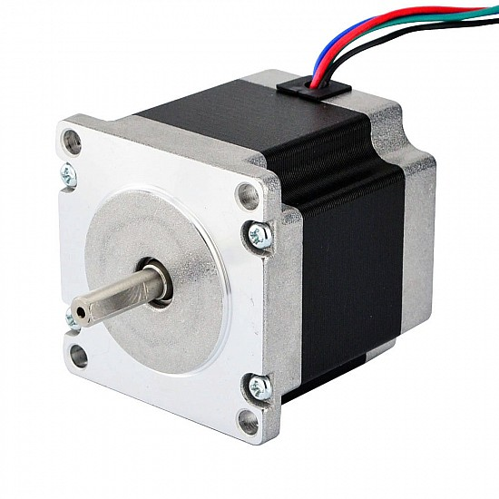
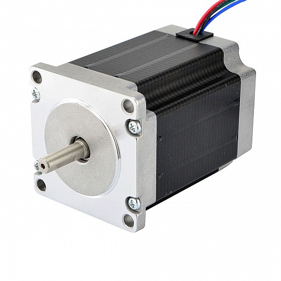
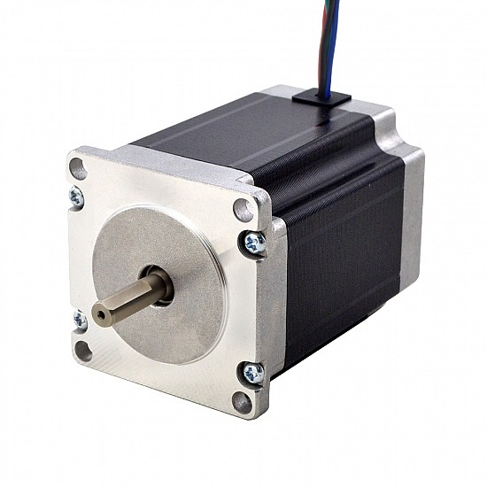

A Nema 23 stepper motor is a stepper motor with a 2.3 x 2.3 inch (57 x 57mm) faceplate. Nema 23 high torque stepper motors provide great value with no quality sacrifice. The version with a step angle of 0.9° is more precise than the typical 1.8° version of the motor. These motors are engineered to provide the highest possible torque but minimize vibration and audible noise. A wide range of motor windings and stack lengths are readily available, or the motors can be customized to meet your machine requirements. We have 8-wire motors that can be connected in all possible configurations: series, unipolar or parallel to maximize flexibility for your application. We can also have the windings customized to perfectly match your voltage, current and maximum torque at operating speeds.

| 23HS22-2804S | 23HS30-2804S | 23HS30-3004S |
|-----|-----|-----|
|  |  |  |
| 1.2Nm(169.93oz.in) 2.8A | 1.85Nm(261.98oz.in) 2.8A | 1.89Nm(267.65oz.in) 3A |

NEMA stepper motor sizes depend on the frame size of the stepper motor. NEMA means the standards set by “National Electrical Manufacturers Association”, which is comprised of 560 major electrical manufacturers in the United States, primarily consisting of manufacturers of equipment and devices for power generation, transmission, distribution, and power applications. The purpose of standard setting is to eliminate misunderstandings between electrical product manufacturers and users and to specify the safety of these product applications.