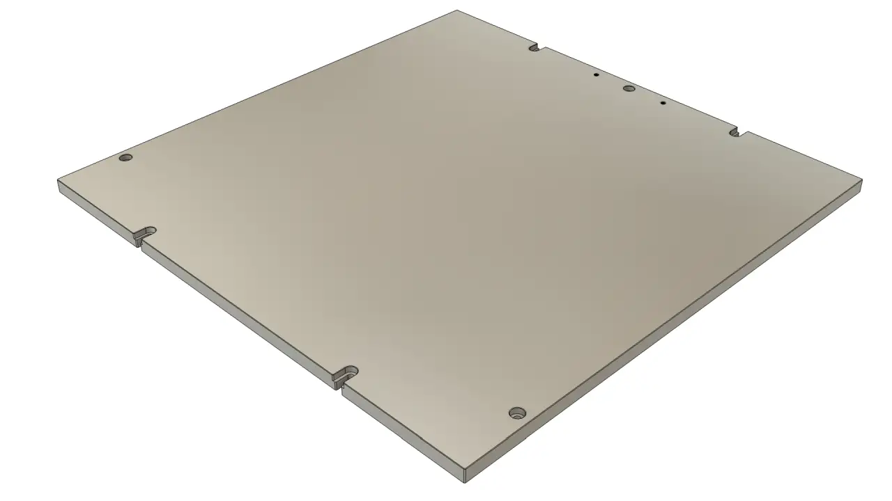
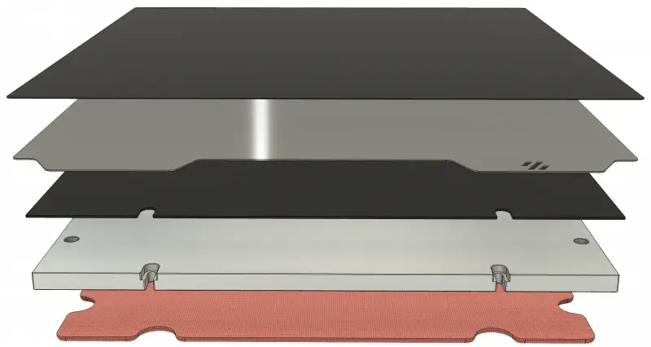

What is the build plate on a 3D printer?
Build Plate (Heated Bed, Print Bed, or Build Plate): Type of build plate used in many 3D printers which keep the base of the build object warm to prevent the object from cooling unevenly and warping as a result. The surface of the 3D printer on which the 3D printed part is formed. Also known as 'bed' or 'build plate'.

**Build Plate (Heated Bed, Print Bed, or Build Plate):**  Type of build plate used in many 3D printers which keep the base of the build object warm to prevent the object from cooling unevenly and warping as a result.The surface of the 3D printer on which the 3D printed part is formed. Also known as ‘bed’ or ‘build plate’.

|  |  |
|------------------------------------|------------------------------------|
| **Start 3D printing on the shoulder of giants!**   3D printing has never been easier with our flexible print surface system.  **Flex Plates:** our most versatile and flexible solution!  **PEI Sheets:** the genuine black Ultem® features superior bonding properties, especially with ABS.  **Spring Steel Sheets:** quick and easy part removal -- let it cool and flex it! They pop just right off!  **Magnetic Sheets:** strongest available on the market, holding your steel sheets flat and secure.  **Build Plates:** made from cast and stress relieved Aluminum. Its unique properties prevent excessive warping and the precision milled surface is the perfect foundation for a flat build surface.  **Silicone Heaters:** special made silicone heater, edge-to-edge, leave no room for cold zones. The power usage is optimized for our build plates and can be used to their full potential without risking deformation. |   | 

