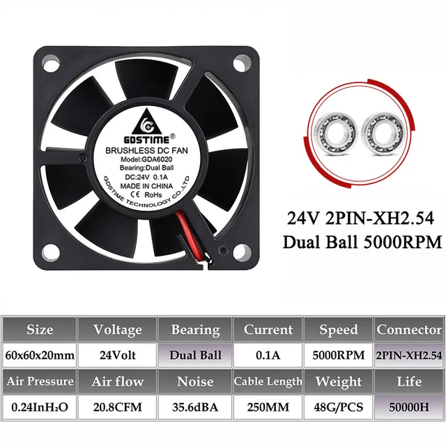

# Fans are cool!

### Axial Fans
| 40x40x10 Axial Fan | Gdstime DC 24V 60x60x20mm Axial 3D Printer Cooling Fan   |
|-----|-----|
|  |   |  
| [Link](https://www.aliexpress.us/item/2251832540325686.html) | [Aliexpress-1](https://www.aliexpress.us/item/2251832540325686.html) [Aliexpress-2](https://www.aliexpress.us/item/2251832540325686.html) |
---

## Centrifugal Fan

4020 24V Cooling Fan Turbo Blower Silent Fan  

   

  * Dimensions: 40x40x20mm  
  * Bearing type: Dual Ball
  * Connector: XH2.54-2Pin/Dupont 
  * Rated Voltage: DC 24V 
  * Rated Speed: 6500RPM±10% 
  * MTBF: 50000 hours 
  * Cable Length: 25cm
  * Weight:23g

 [Aliexpress](https://www.aliexpress.us/item/3256801278415934.html) 

 

