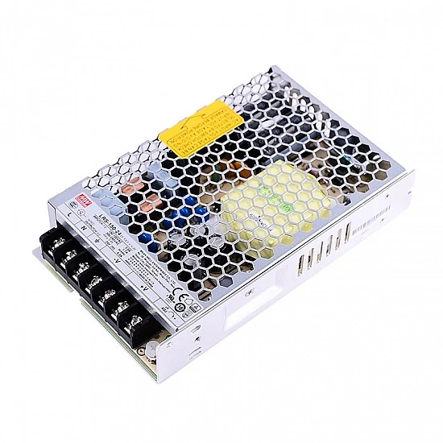

# LRS-150-24 MEANWELL 150W 24VDC 6.5A 115/230VAC Enclosed Switching Power Supply

## Stepperonline.com

MEANWELL LRS-150 series is a 150W single-output enclosed type power supply with 30mm of low profile design.  
Adopting the input of 115VAC or 230VAC(selectable by switch), the entire series provides an output voltage line of 12V, 15V, 24V, 36V and 48V. In addition to the high efficiency up to 90%, the design of metallic mesh case enhances the heat dissipation of LRS-150 that the whole series operates from -30℃ through 70℃ under air convection without a fan. Delivering an extremely low no load power consumption (less than 0.5W), it allows the end system to easily meet the worldwide energy requirement.  
LRS-150 has the complete protection functions and 5G anti-vibration capability; it is complied with the international safety regulations such as TUV BS EN / EN62368-1, BS EN / EN60335-1,BS EN / EN61558-1/-2-16, UL62368-1 and GB4943. LRS-150 series serves as a high price-to-performance power supply solution for various industrial applications.  

Features

   * Brand MEANWELL
   * 24V DC 6.5A output
   * AC input voltage range: 85 ~ 132VAC
   * Rated power: 154.8W
   * AC input range selectable by switch
   * Withstand 300VAC surge input for 5 second
   * No load power consumption < 0.5W
   * Miniature size and 1U low profile
   * High operating temperature up to 70℃
   * Protections: Short circuit / Overload / Over voltage / Over temperature
   * Cooling by free air convection
   * Compliance to IEC / BS EN / EN 60335-1(PD3) and IEC / BS EN / EN61558-1, 2-16 for household appliances
   * Operating altitude up to 5000 meters
   * Withstand 5G vibration test
   * High efficiency, long life and high reliability
   * LED indicator for power on
   * Over voltage category Ⅲ
   * 100% full load burn-in test
   * 3 years warranty

Applications

   * Industrial automation machinery
   * Industrial control system
   * Mechanical and electrical equipment
   * Electronic instruments, equipments or apparatus
   * Household appliances

Resources

   * Full Datasheet: [LRS-150-24.pdf](PDF/LRS-150.pdf)
   * Cad Drawings: [LRS-150-24.stp](CAD/LRS-150-24.stp) 
   * [LRS-150-24.stl](CAD/LRS-150-24.stl)
