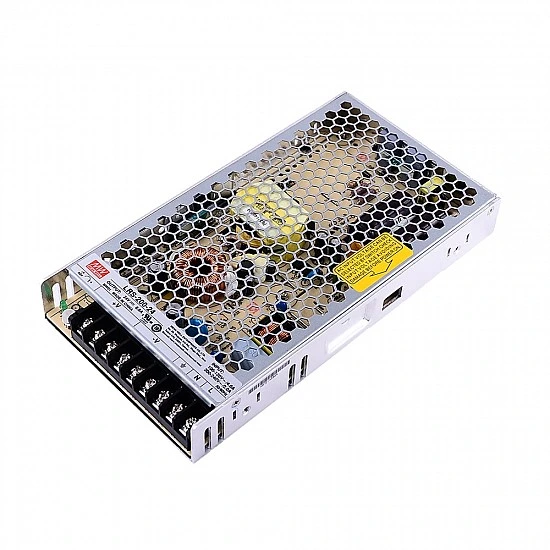

# LRS-200-24 MEANWELL 200W 24VDC 8.8A 115/230VAC Enclosed Switching Power Supply

## Stepperonline.com

MEANWELL LRS-200 series is a 200W single-output enclosed type power supply with 30mm of low profile design. Adopting the input of 115VAC or 230VAC (select by switch), the entire series provides an output voltage line of 3.3V, 4.2V, 5V, 12V, 15V, 24V, 36V and 48V.  
In addition to the high efficiency up to 90%, the design of metallic mesh case enhances the heat dissipation of LRS-200 that the whole series operates from -25℃ through 70℃ under air convection without a fan.Delivering an extremely low no load power consumption (less than 0.75W), it allows the end system to easily meet the worldwide energy requirement.  
LRS-200 has the complete protection functions and 5G anti-vibration capability; it is complied with the international safety regulations such as IEC / UL 62368-1. LRS-200 series serves as a high price-to-performance power supply solution for various industrial applications.   

Features

   * Brand MEANWELL
   * 24V DC 8.8A output
   * AC input voltage range: 90 ~ 132VAC
   * Rated power: 211.2W
   * AC input range selectable by switch
   * Withstand 300VAC surge input for 5 second
   * Protections: Short circuit / Overload / Over voltage / Over temperature
   * Cooling by free air convection
   * 1U low profile
   * Withstand 5G vibration test
   * LED indicator for power on
   * No load power consumption<0.75W
   * 100% full load burn-in test
   * High operating temperature up to 70℃
   * Operating altitude up to 5000 meters (Note.8)
   * High efficiency, long life and high reliability
   * 3 years warranty

Applications

   * Industrial automation machinery
   * Industrial control system
   * Mechanical and electrical equipment
   * Electronic instruments, equipments or apparatus

Resources

   * Full Datasheet: [LRS-200-24.pdf](PDF/LRS-200.pdf)
   * Cad Drawings: [LRS-200-24.stp](CAD/LRS-200-24.stp) 
   * [LRS-200-24.stl](CAD/LRS-200-24.stl)
