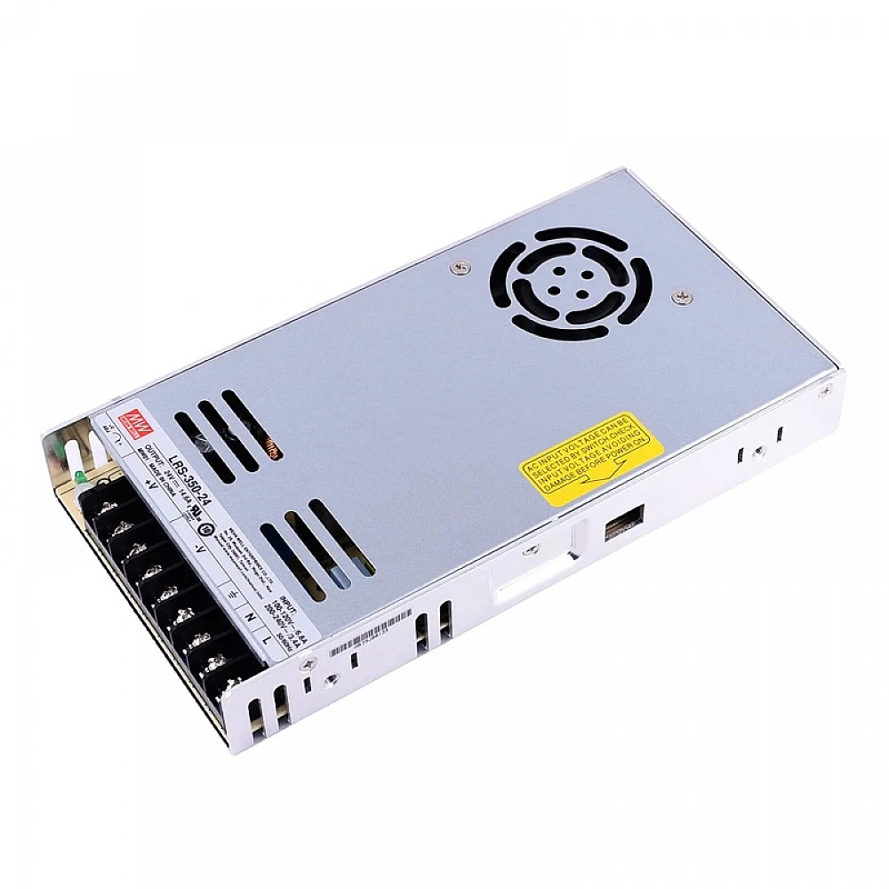

# LRS-350-24 MEANWELL 350W 24VDC 14.6A 115/230VAC Enclosed Switching Power Supply

## Stepperonline.com

LRS-350 series is a 350W single-output enclosed type power supply with 30mm of low profile design. Adopting the input of 115VAC or 230VAC (select by switch), the entire series provides an output voltage line of 3.3V, 4.2V, 5V, 12V, 15V, 24V, 36V and 48V. In addition to the high efficiency up to 89%, with the built-in long life fan LRS-350 can work under -25~ +70℃ with full load. Delivering an extremely low no load power consumption (less than 0.75W), it allows the end system to easily meet the worldwide energy requirement.LRS-350 has the complete protection functions and 5G anti-vibration capability; it is complied with the international safety regulations such as IEC / UL 62368-1.  
LRS-350 series serves as a high price-to-performance power supply solution for various industrial applications.

Features

 * Brand MEANWELL
 * 24V DC 14.6A output
 * AC input voltage range: 90 ~ 132VAC
 * Rated power: 350.4W
 * AC input range selectable by switch
 * Withstand 300VAC surge input for 5 second
 * Protections: Short circuit / Overload / Over voltage / Over temperature
 * Forced air cooling by built-in DC fan
 * Built-in cooling Fan ON-OFF control
 * 1U low profile
 * Withstand 5G vibration test
 * LED indicator for power on
 * No load power consumption<0.75W
 * 100% full load burn-in test
 * High operating temperature up to 70℃
 * Operating altitude up to 5000 meters (Note.8)
 * High efficiency, long life and high reliability
 * 3 years warranty

Applications

 * Industrial automation machinery
 * Industrial control system
 * Mechanical and electrical equipment
 * Electronic instruments, equipments or apparatus

Resources

  * Full Datasheet: [LRS-350-24.pdf](PDF/LRS-350-24.pdf)
  * Cad Drawings: [LRS-350-24.stp](CAD/LRS-350-24.stp) 
  * [LRS-350-24.stp](CAD/LRS-350-24.stl)
