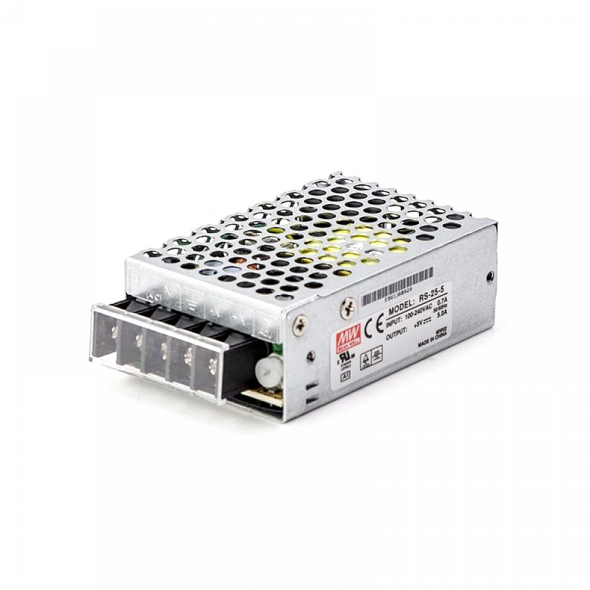

# RS-25-5 MEANWELL 25W Single Output Switching Power Supply

## Stepperonline.com

Features

   * Brand MEANWELL
   * 5V DC 5A output
   * AC input voltage range: 88 ~ 264VAC
   * Rated power: 25W
   * Universal AC input / Full range
   * Protections: Short circuit / Overload / Over voltage / Over temperature
   * Cooling by free air convection
   * LED indicator for power on
   * 100% full load burn-in test
   * All using 105℃ long life electrolytic capacitors
   * Withstand 300VAC surge input for 5 second
   * High operating temperature up tp 70℃
   * Withstand 5G vibration test
   * High efficiency, long life and high reliability
   * 3 years warranty

Resources

   * Full Datasheet: [RS-25-5.pdf](PDF/RS-25.pdf)
   * Cad Drawings: [RS-25-5.stp](CAD/RS-25-5.stp) 
