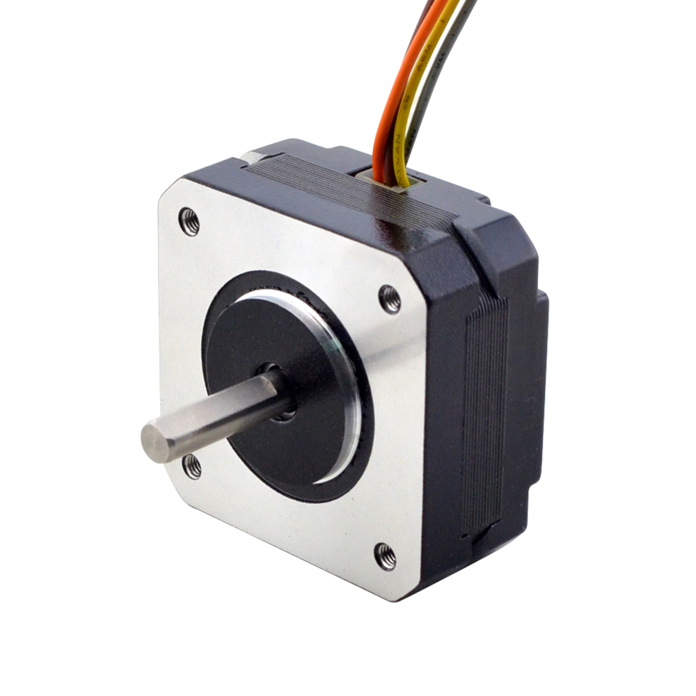

# Nema 17 High Temp Stepper Motor 16Ncm(22.7oz.in) Extruder Motor Insulation Class H 180C

## Stepperonline.com

This motor is designed for high temperature application. We have customized the motor's winding, bearing, magnetic steel and also the plastic skeleton to achieve insulation class of H, the temperature reach up to 180C degree. This motor is widely used in 3D Printer extruder.

Electrical Specification

  * Manufacturer Part Number: 17HS08-1004S-H
  * Motor Type: Bipolar Stepper
  * Step Angle: 1.8deg
  * Holding Torque: 16Ncm(22.7oz.in)
  * Rated Current/phase: 1.0A
  * Phase Resistance: 3.7ohms
  * Inductance: 4.5mH±20%(1KHz)
  * Insulation Class: H 180C(356F)

Physical Specification

  * Frame Size: 42 x 42mm
  * Body Length: 21.5mm
  * Shaft Diameter: Φ5mm
  * Shaft Length: 20mm
  * D-cut Length: 16.5mm
  * Number of Leads: 4
  * Lead Length: 400mm
  * Weight: 150g

Connection
| A+ | A- | B+ | B- |
|-----|-----|-----|-----|
| GRY | BRN | ORG | YEL |
	
Resources

  Full Datasheet: [17HS08-1004S-H.pdf](https://www.omc-stepperonline.com/download/17HS08-1004S-H.pdf)

