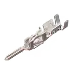
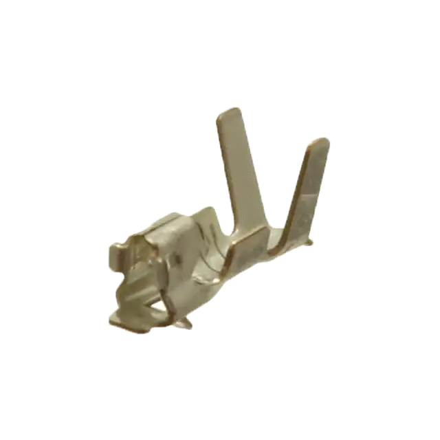

# Cables

## Silicone Cable  
What is silicone cable used for?  
The mineral nature of silicone rubber insulation makes the silicone cables uniquely suitable for fire resistant cables required to maintain circuit integrity in the event of a fire. When the cable is in a fire situation a film of fused silica is deposited onto the conductor providing substantial insulation properties.

This page lists sources and part numbers for various cable related parts for Voron printers.

Electrical Components
---------------------

### Connectors

| Part Name | Used In / Description | Photo | Manufacturer Part Number | Source / Source Part Number |
|-----------|-----------------------|--------------------------|-----------------------------|-----------------------------|
| 4-pin connector (body) | Micro-Fit 3.0 Receptacle Housing, Single Row, 4 Circuits, UL 94V-0, Black |  | Molex: 436450400 | [Mouser: 538-43645-0400 ](https://mou.sr/3R7U4pF) [Digikey: WM1847-ND](https://www.digikey.com/en/products/detail/molex/0436450400/268976) [TME: MX-70066-0178](https://www.tme.eu/en/details/mx-70066-0178/raster-signal-connectors-2-54mm/molex/50579404/) |
| 4-pin connector (body) Male pins | Micro-Fit 3.0 Plug Housing, Single Row, 4 Circuits, UL 94V-0, Low-Halogen, Black |  | Molex: 436400401 | [Mouser: 538-43640-0401](https://mou.sr/4aAoubL) [Digikey: WM1857-ND](https://www.digikey.com/en/products/detail/molex/0436400401/268986) [TME: MX-43640-0401](https://www.tme.eu/en/details/mx-43640-0401/raster-signal-connectors-3-00mm/molex/436400401/) |
| 3-pin connector (body) | Micro-Fit 3.0 Receptacle Housing, Single Row, 3 Circuits, UL 94V-0, Low-Halogen, Black |  | Molex: 436450300 | [Mouser: 538-43645-0300](https://mou.sr/3Y9esH9) [Digikey: WM1846-ND](https://www.digikey.com/en/products/detail/molex/0436450300/268975) [TME: MX-43645-0300](https://www.tme.eu/en/details/mx-43645-0300/raster-signal-connectors-3-00mm/molex/436450300/) |
| 3-pin connector (body) Male pins | Micro-Fit 3.0 Plug Housing, Single Row, 3 Circuits, UL 94V-0, Low-Halogen, Black |  | Molex: 436400301 | [Mouser: 538-43640-0301 ](https://mou.sr/4aJyPSA) [Digikey: WM1856-ND](https://www.digikey.com/en/products/detail/molex/0436400301/268985) [TME: MX-43640-0301](https://www.tme.eu/en/details/mx-43640-0301/raster-signal-connectors-3-00mm/molex/436400301/) |
| 2- pin connector (body) | Micro-Fit 3.0 Receptacle Housing, Single Row, 2 Circuits, UL 94V-0, Low-Halogen, Black |  | Molex: 436450200 | [Mouser: 538-43645-0200](https://mou.sr/3kTyQP2) [DigiKey: WM1845-ND](https://www.digikey.com/en/products/detail/molex/0436450200/268974) [TME: MX-43645-0200](https://www.tme.eu/en/details/mx-43645-0200/raster-signal-connectors-3-00mm/molex/436450200/) |
| 2- pin connector (body) Male pins | Micro-Fit 3.0 Plug Housing, Single Row, 3 Circuits, UL 94V-0, Low-Halogen, Black |  | Molex: 436400201 | [Mouser:  538-43640-0301](https://mou.sr/4aJyPSA) [DigiKey: WM1856-ND](https://www.digikey.com/en/products/detail/molex/0436400301/268985) [TME: MX-70066-0176](https://www.tme.eu/en/details/mx-70066-0176/raster-signal-connectors-2-54mm/molex/50579402/) |
| Terminal / Pin for keyed connectors | FMicro-Fit 3.0 Crimp Terminal, Female, with Tin (Sn) Plated Phosphor Bronze Contact, 20-24 AWG |  | Molex: 430300007 | [Mouser: 538-43030-0007 ](https://mou.sr/3DY1hSY) [DigiKey: WM1837-ND](https://www.digikey.com/en/products/detail/molex/0430300007/252479) [TME: MX-43030-0007](https://www.tme.eu/en/details/mx-43030-0007/raster-signal-connectors-3-00mm/molex/430300007/) |
| Terminal / Pin for keyed connectors | Micro-Fit 3.0 Crimp Terminal, Male, with Tin (Sn) Plated Phosphor Bronze Contact, 20-24 AWG |  | Molex: 430310007 | [Mouser: 538-43031-0007](https://mou.sr/44hImwE) [DigiKey: WM1841-ND](https://www.digikey.com/en/products/detail/molex/0430310007/252483) [TME: MX-43031-0007](https://www.tme.eu/en/details/mx-43031-0007/raster-signal-connectors-3-00mm/molex/430310007/) |
| Terminal / Pin for keyed connectors | 2.50mm Pitch Mini-Latch Crimp Terminal, Female, Phosphor Bronze, 22-28 AWG |  | SXH-001T-P0.6N   | [TTI Europe](https://www.ttieurope.com/content/ttieurope/en/apps/part-detail.html?partsNumber=50802-8000&mfgShortname=MLX) [DigiKey: 455-4220-2-ND](https://www.digikey.com/en/products/detail/jst-sales-america-inc/SXH-001T-P0-6N/7041446) [TME: SXH-001T-P0.6](https://www.tme.eu/en/details/sxh-001t-p0.6/raster-signal-connectors-2-50mm/jst/) |
| 4-pin connector (body) | 2.50mm Pitch, Receptacle Crimp Housing, Single Row, 4 Circuits, 22-28 AWG |  | XHP-4 | [TTI Europe: XHP-4](https://www.ttieurope.com/content/ttieurope/en/apps/part-detail.html?partsNumber=XHP-4&mfgShortname=JST&productId=483198106&minQty=1000&autoRedirect=true) [DigiKey: XHP-4](https://www.digikey.com/en/products/detail/jst-sales-america-inc/XHP-4/683353) [TME: XHP-4](https://www.tme.eu/en/details/xhp-4/raster-signal-connectors-2-50mm/jst/) |
| 3-pin connector (body) | 2.50mm Pitch, Receptacle Crimp Housing, Single Row, 3 Circuits, 22-28 AWG |  | XHP-3 | [TTI Europe: XHP-3](https://www.ttieurope.com/content/ttieurope/en/apps/part-detail.html?partsNumber=XHP-3&mfgShortname=JST&productId=483198104&minQty=1000) [DigiKey: XHP-3](https://www.digikey.com/en/products/detail/jst-sales-america-inc/XHP-3/1651017) [TME: XHP-3](https://www.tme.eu/en/details/xhp-3/raster-signal-connectors-2-50mm/jst/) |
| 2-pin connector (body) | 2.50mm Pitch, Receptacle Crimp Housing, Single Row, Friction Lock, 2 Circuits, 22-28 AWG |  | XHP-2 | [TTI Europe: XHP-2](https://www.ttieurope.com/content/ttieurope/en/apps/part-detail.html?partsNumber=XHP-2&mfgShortname=JST&productId=483198098&minQty=1000) [DigiKey: XHP-2](https://www.digikey.com/en/products/detail/jst-sales-america-inc/XHP-2/555485) [TME: XHP-2](https://www.tme.eu/en/details/xhp-2/raster-signal-connectors-2-50mm/jst/) |
| 2/3/4/5/6 Pin (Kit) | JST-XH Plug Kit, 2.54 mm Pin Male and Female Adapter Cable Male Female 2.54 mm Female Metal Pin Connector, 22-28 AWG |  | JST XH | [JST-XH Plug Kit](https://www.amazon.com/Connector-Housing-Adapter-Terminal-Connectors/dp/B0BZDCGJ32/ref=sr_1_3?keywords=JST-XH+Plug+Kit&qid=1704224672&sr=8-3)|

### Fans and Blowers

| Part Name | Used In / Description | Specification | Manufacture Part Number | Source / Source Part Number |
|-----------|-----------------------|---------------|-------------------------|-----------------------------|
| Noctua fan      | Hotend fan            | - 5V - 0.05A - 4500 RPM - Size: 40x40x10 mm - Mounting hole spacing: 32x32 mm - Airflow: 8,2 m³/h (4.83 CFM) - Static Pressure: 1,78 mm H₂O | Noctua NF-A4x10 5V | [Noctua website](https://noctua.at/en/products/fan/nf-a4x10-flx) |
| 5015 Blower fan | Nozzle fan            | - 5V - 0.30A - 4500 RPM - Size: 50x50x15 mm - Mounting hole spacing: 38x43 mm - Airflow: 3.8 CFM                                                | ?                  | ?                                                |

### Heated Bed

| Part Name | Used In / Description | Specification | Manufacture Part Number | Source / Source Part Number |
|-----------|-----------------------|---------------|-------------------------|-----------------------------|
| Magnets   | Magnets for MK52 heated bed | -   Neodymium Material Type: N35UH -   Size: 20x6x2.3 mm -   Hole depth in MK52: 2.5-2.7 mm -   Maximum Operating Temp: 180°C   | ?                       | ?                           |

### Power Supply

| Part Name | Used In / Description | Specification | Manufacturer Part Number | Source / Source Part Number |
|-----------|-----------------------|---------------|--------------------------|-----------------------------|
| Delta PSU 24V 320W | Compatible PSU for MK3 | 24V 320W | Delta PMF-24V320WCAB | [Delta website](http://www.deltapsu.com/products/panel-mount-power-supply/PMF-24V320WCGB) |
| Mean Well PSU 24V 320W | Compatible PSU for MK3| 24V 320W | Mean Well SP-320-24 | [Mean Well website](https://www.meanwell.com/webapp/product/search.aspx?prod=SP-320) |

### Power Cables and Connectors

Always get known brand from reliable source for those parts, they are critical and might be dangerous if not correctly manufactured.

| Part Name | Used In / Description | Specification | Manufacturer Part Number | Source / Source Part Number |
|-----------|-----------------------|---------------|--------------------------|-----------------------------|
| 115/230 VAC Cables | PSU | 16 AWG or 1.5mm2 | | | |
| 12/24 VDC Cables | PSU to Rambo/Einsy | 14 AWG or 2mm2 | | | |
| Terminal Quick Connects Connector | Power plug, Power switch | -   16 AWG -   Tab width: 6.35mm (according to your power plug and switch connectors) -   Fully insulated | | [Digikey](https://www.digikey.com/products/en/connectors-interconnects/terminals-quick-connects-quick-disconnect-connectors/392?k=&pkeyword=&pv1048=20&sf=0&FV=fff40016%2Cfff8041a%2C740002%2C1380087%2C13800b1%2C1380004%2C1380236%2C170000c%2C1700004%2C1700007%2C1f140000%2Cffe00188%2Cfffc0115&quantity=&ColumnSort=0&page=1&pageSize=25) |
| Terminal Spade Connector 115/230 VAC | PSU (115/230 VAC) | -   16 AWG -   Flanged terminal type -   #6 Stud/Tab size -   Insulated -   Spade width: 6.35 to 8mm | | [Digikey](https://www.digikey.com/products/en/connectors-interconnects/terminals-spade-connectors/391?k=&pkeyword=&pv78=191&sf=0&FV=fff40016%2Cfff80419%2C1700004%2C4a800ff%2C4ac003b%2Cf88001e%2Cf880024%2Cf88017b%2Cf880185%2Cf880186%2C1f140000%2Cffe00187%2C1380086%2C13800bf&quantity=&ColumnSort=0&page=1&pageSize=25) |
| Terminal Spade Connector 12/24 VDC | PSU (12/24 VDC), Rambo/Einsy | -   14 AWG -   Flanged terminal type -   #6 Stud/Tab size -   Insulated -   Spade width: 6.35 to 8mm | | [Digikey](https://www.digikey.com/products/en/connectors-interconnects/terminals-spade-connectors/391?k=&pkeyword=&pv994=30&pv994=36&pv994=389&pv994=379&pv994=390&sf=0&FV=fff40016%2Cfff80419%2C1380086%2C13800be%2C1380239%2C1700004%2C4a800ff%2C4ac003b%2C1f140000%2Cffe00187&quantity=&ColumnSort=0&page=1&pageSize=25) |
| Terminal Ring Connector | Heated bed | -   14 AWG -   M3 Stud/Tab size -   Insulated -   Spade width: 6.35 to 8mm | | [Digikey](https://www.digikey.com/products/en/connectors-interconnects/terminals-ring-connectors/394?k=&pkeyword=&pv299=178&sf=0&FV=fff40016%2Cfff8041c%2C1380086%2C13800be%2C1380003%2C1380211%2Cffe0018a%2C1700004%2C1f140000&quantity=&ColumnSort=0&page=1&pageSize=25) |
