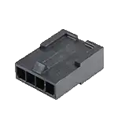
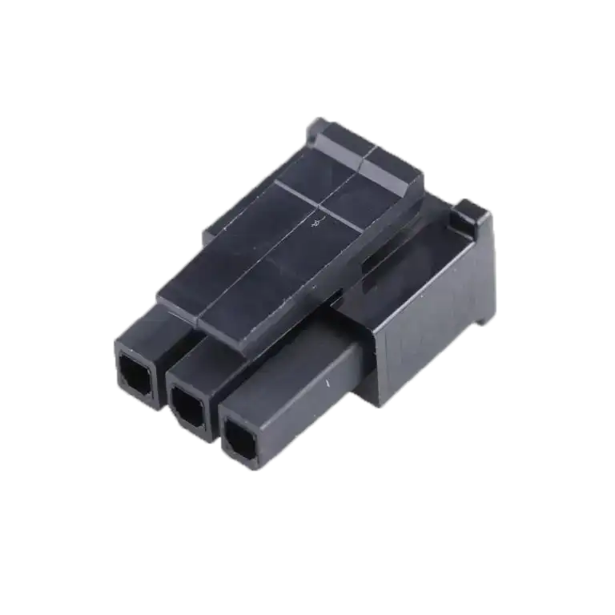
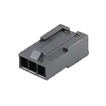
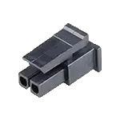
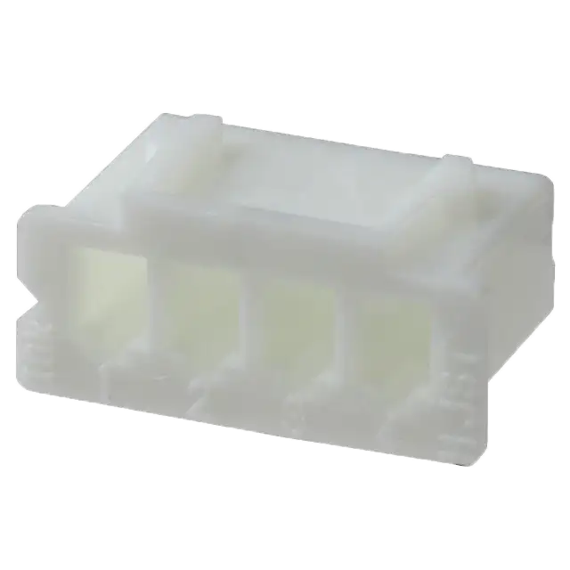
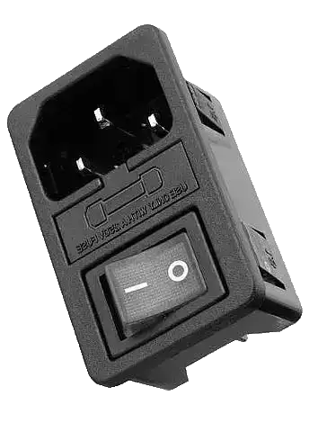
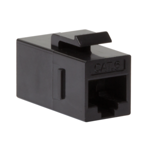
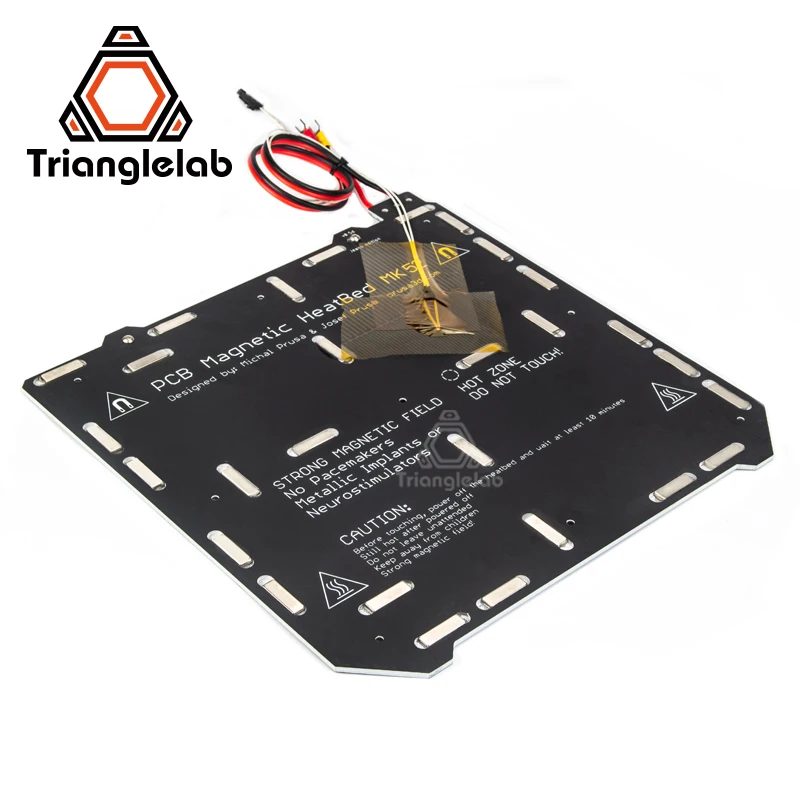

# Cables

## Silicone Cable  
What is silicone cable used for?  
The mineral nature of silicone rubber insulation makes the silicone cables uniquely suitable for fire resistant cables required to maintain circuit integrity in the event of a fire. When the cable is in a fire situation a film of fused silica is deposited onto the conductor providing substantial insulation properties.

| Part Name |  Description | Photo | Mfg Part # | Source  |
|-----------|-----------------------|--------------------------|-----------------------------|-----------------------------|
| 24AWG Silicone Cable | - Rated voltage: 600V  -   Temperature range: -60°C~+200°C  - Diameter of each copper wire: 0.08mm |  | 3256805702676823 | [LD999 Store   Aliexpress](https://www.aliexpress.us/item/3256805702676823.html) |
| 20AWG Silicone Cable | Wire Length :6M / 19.6Ft each color  | Red+Blue+Green+Yellow+Black | — | [striveday: B01LH1FV9A ](https://www.amazon.com/gp/product/B01LH1FV9A/?th=1)  |
| 16AWG Silicone Cable | — | Red+Black+Green | — | [Aliexpress](https://www.aliexpress.us/item/3256801268521358.html?spm=a2g0o.productlist.main.5.34b320f3FXSyPf&algo_pvid=65f196c7-2c18-43bd-8fd5-1eba33c677d2&aem_p4p_detail=2024010215231311401946493958560001050775&algo_exp_id=65f196c7-2c18-43bd-8fd5-1eba33c677d2-2&pdp_npi=4%40dis%21USD%211.48%211.26%21%21%211.48%21%21%40211b88f017042377934685971e54d1%2112000017883507749%21sea%21US%210%21AB&curPageLogUid=bTXE55USuTf4&search_p4p_id=2024010215231311401946493958560001050775_3) |

Connection Components
---------------------

### Connectors

| Part Name |  Description | Photo | Mfg Part # | Source / Source Part Number |
|-----------|-----------------------|--------------------------|-----------------------------|-----------------------------|
| Spade Terminal | Avikrimp Spade Tongue Terminal for 18-22 AWG Wire |  | Molex: 191980006 | [Mouser: 538-19198-0006](https://mou.sr/4aEUnQl) [Digikey: 23-0191980006-ND](https://www.digikey.com/en/products/detail/molex/0191980006/279166) [tti: 19198-0006](https://www.ttieurope.com/content/ttieurope/en/apps/part-detail.html?partsNumber=19198-0006) |
| Quick Connect | Perma-Seal Female Quick Disconnect Receptacle for 18-22 AWG Wire, Tab Size 6.35 x 0.81mm |  | Molex: 191980006 | [Mouser: 538-19164-0017 ](https://mou.sr/4aKsQx8) [Digikey: WM18429-ND](https://www.digikey.com/en/products/detail/molex/0191640017/279230) [tti: 19164-0017](https://www.ttieurope.com/content/ttieurope/en/apps/part-detail.html?partsNumber=19164-0017) |
| 4-pin connector (body) | Micro-Fit 3.0 Receptacle Housing, Single Row, 4 Circuits, UL 94V-0, Black |  | Molex: 436450400 | [Mouser: 538-43645-0400 ](https://mou.sr/3R7U4pF) [Digikey: WM1847-ND](https://www.digikey.com/en/products/detail/molex/0436450400/268976) [TME: MX-70066-0178](https://www.tme.eu/en/details/mx-70066-0178/raster-signal-connectors-2-54mm/molex/50579404/) |
| 4-pin connector (body) Male pins | Micro-Fit 3.0 Plug Housing, Single Row, 4 Circuits, UL 94V-0, Low-Halogen, Black |  | Molex: 436400401 | [Mouser: 538-43640-0401](https://mou.sr/4aAoubL) [Digikey: WM1857-ND](https://www.digikey.com/en/products/detail/molex/0436400401/268986) [TME: MX-43640-0401](https://www.tme.eu/en/details/mx-43640-0401/raster-signal-connectors-3-00mm/molex/436400401/) |
| 3-pin connector (body) | Micro-Fit 3.0 Receptacle Housing, Single Row, 3 Circuits, UL 94V-0, Low-Halogen, Black |  | Molex: 436450300 | [Mouser: 538-43645-0300](https://mou.sr/3Y9esH9) [Digikey: WM1846-ND](https://www.digikey.com/en/products/detail/molex/0436450300/268975) [TME: MX-43645-0300](https://www.tme.eu/en/details/mx-43645-0300/raster-signal-connectors-3-00mm/molex/436450300/) |
| 3-pin connector (body) Male pins | Micro-Fit 3.0 Plug Housing, Single Row, 3 Circuits, UL 94V-0, Low-Halogen, Black |  | Molex: 436400301 | [Mouser: 538-43640-0301 ](https://mou.sr/4aJyPSA) [Digikey: WM1856-ND](https://www.digikey.com/en/products/detail/molex/0436400301/268985) [TME: MX-43640-0301](https://www.tme.eu/en/details/mx-43640-0301/raster-signal-connectors-3-00mm/molex/436400301/) |
| 2- pin connector (body) | Micro-Fit 3.0 Receptacle Housing, Single Row, 2 Circuits, UL 94V-0, Low-Halogen, Black |  | Molex: 436450200 | [Mouser: 538-43645-0200](https://mou.sr/3kTyQP2) [DigiKey: WM1845-ND](https://www.digikey.com/en/products/detail/molex/0436450200/268974) [TME: MX-43645-0200](https://www.tme.eu/en/details/mx-43645-0200/raster-signal-connectors-3-00mm/molex/436450200/) |
| 2- pin connector (body) Male pins | Micro-Fit 3.0 Plug Housing, Single Row, 3 Circuits, UL 94V-0, Low-Halogen, Black |  | Molex: 436400201 | [Mouser:  538-43640-0301](https://mou.sr/4aJyPSA) [DigiKey: WM1856-ND](https://www.digikey.com/en/products/detail/molex/0436400301/268985) [TME: MX-70066-0176](https://www.tme.eu/en/details/mx-70066-0176/raster-signal-connectors-2-54mm/molex/50579402/) |
| Terminal / Pin for keyed connectors | FMicro-Fit 3.0 Crimp Terminal, Female, with Tin (Sn) Plated Phosphor Bronze Contact, 20-24 AWG |  | Molex: 430300007 | [Mouser: 538-43030-0007 ](https://mou.sr/3DY1hSY) [DigiKey: WM1837-ND](https://www.digikey.com/en/products/detail/molex/0430300007/252479) [TME: MX-43030-0007](https://www.tme.eu/en/details/mx-43030-0007/raster-signal-connectors-3-00mm/molex/430300007/) |
| Terminal / Pin for keyed connectors | Micro-Fit 3.0 Crimp Terminal, Male, with Tin (Sn) Plated Phosphor Bronze Contact, 20-24 AWG |  | Molex: 430310007 | [Mouser: 538-43031-0007](https://mou.sr/44hImwE) [DigiKey: WM1841-ND](https://www.digikey.com/en/products/detail/molex/0430310007/252483) [TME: MX-43031-0007](https://www.tme.eu/en/details/mx-43031-0007/raster-signal-connectors-3-00mm/molex/430310007/) |
| Terminal / Pin for keyed connectors | 2.50mm Pitch Mini-Latch Crimp Terminal, Female, Phosphor Bronze, 22-28 AWG |  | SXH-001T-P0.6N   | [TTI Europe](https://www.ttieurope.com/content/ttieurope/en/apps/part-detail.html?partsNumber=50802-8000&mfgShortname=MLX) [DigiKey: 455-4220-2-ND](https://www.digikey.com/en/products/detail/jst-sales-america-inc/SXH-001T-P0-6N/7041446) [TME: SXH-001T-P0.6](https://www.tme.eu/en/details/sxh-001t-p0.6/raster-signal-connectors-2-50mm/jst/) |
| 4-pin connector (body) | 2.50mm Pitch, Receptacle Crimp Housing, Single Row, 4 Circuits, 22-28 AWG |  | XHP-4 | [TTI Europe: XHP-4](https://www.ttieurope.com/content/ttieurope/en/apps/part-detail.html?partsNumber=XHP-4&mfgShortname=JST&productId=483198106&minQty=1000&autoRedirect=true) [DigiKey: XHP-4](https://www.digikey.com/en/products/detail/jst-sales-america-inc/XHP-4/683353) [TME: XHP-4](https://www.tme.eu/en/details/xhp-4/raster-signal-connectors-2-50mm/jst/) |
| 3-pin connector (body) | 2.50mm Pitch, Receptacle Crimp Housing, Single Row, 3 Circuits, 22-28 AWG |  | XHP-3 | [TTI Europe: XHP-3](https://www.ttieurope.com/content/ttieurope/en/apps/part-detail.html?partsNumber=XHP-3&mfgShortname=JST&productId=483198104&minQty=1000) [DigiKey: XHP-3](https://www.digikey.com/en/products/detail/jst-sales-america-inc/XHP-3/1651017) [TME: XHP-3](https://www.tme.eu/en/details/xhp-3/raster-signal-connectors-2-50mm/jst/) |
| 2-pin connector (body) | 2.50mm Pitch, Receptacle Crimp Housing, Single Row, Friction Lock, 2 Circuits, 22-28 AWG |  | XHP-2 | [TTI Europe: XHP-2](https://www.ttieurope.com/content/ttieurope/en/apps/part-detail.html?partsNumber=XHP-2&mfgShortname=JST&productId=483198098&minQty=1000) [DigiKey: XHP-2](https://www.digikey.com/en/products/detail/jst-sales-america-inc/XHP-2/555485) [TME: XHP-2](https://www.tme.eu/en/details/xhp-2/raster-signal-connectors-2-50mm/jst/) |
| 2/3/4/5/6 Pin (Kit) | JST-XH Plug Kit, 2.54 mm Pin Male and Female Adapter Cable Male Female 2.54 mm Female Metal Pin Connector, 22-28 AWG |  | JST XH | [JST-XH Plug Kit](https://www.amazon.com/Connector-Housing-Adapter-Terminal-Connectors/dp/B0BZDCGJ32/ref=sr_1_3?keywords=JST-XH+Plug+Kit&qid=1704224672&sr=8-3)|

### Power Connection

| Part Name |  Description | Photo | Mfg Part # | Source / Source Part Number |
|-----------|-------------------------|-----------------|--------------------------|-----------------------------|
| Power Inlet  Combination consists  of appliance plug, 2-pole  rocker switch and fuse holder. | - Number of poles: 2 + PE  - Continuous current: 10A  - Fuse holder: 6.3A  - Rated voltage: 250V AC  - With rocker switch and fuse holder  - Connection by flat cable plug 4.8mm  - Snap-in assembly |  | 59JR-1011FR |[ Fermio Labs: KB-INLET-10A](https://fermio.xyz/k-b/power-inlet-iec-60320/) [Amazon.DE 501638 cold device connector plug](https://www.amazon.de/501638-Kaltgeraete-Steckverbinder-Stecker-vertikal-Gesamtpolzahl/dp/B005G3QGS6/ref=asc_df_B005G3QGS6/?tag=googshopde-21&linkCode=df0&hvadid=633969664940&hvpos=&hvnetw=g&hvrand=2287905193562039826&hvpone=&hvptwo=&hvqmt=&hvdev=c&hvdvcmdl=&hvlocint=&hvlocphy=9044215&hvtargid=pla-2203891421972&psc=1&mcid=7fc7aa97c50b323eb9526f752d8bdbd4&th=1&psc=1) [Amazon US](https://www.amazon.com/FILSHU-Current-Socket-Rocker-Switch/dp/B0895T9NXF/ref=sr_1_10?crid=28NSQM25XVSVF&keywords=Power+Inlet%2C+IEC+60320&qid=1704841772&sprefix=power+inlet%2C+iec+60320%2Caps%2C174&sr=8-10) | 
|  |  |  |  |  |

### RJ-45 / USB Panel Mount

| Part Name |  Description | Photo | Mfg Part # | Source / Source Part Number |
|-----------|-----------------------|---------------|-------------------------|-----------------------------|
| Keystone Inline Coupler RJ45 | Snap-in Keystone Coupler provides a female-to-female feed-through connection for easy cable hook-up |  | NK4012 | [Fermio](https://fermio.xyz/logilink/logilink-cat.6-keystone-inline-coupler-utp/)  [Lecktor](https://lecktor.com/en/connectors/1158-keystone-socket-unshielded-cat6-4052792026870.html) [Mouser](https://mou.sr/3twU8X1) [TME](https://www.tme.com/us/en-us/details/log-nk4012/rj-connectors/logilink/nk4012/)  |
| Keystone in-line coupler USB-A 3.0 female > USB-A 3.0 female | Snap-in Keystone Module suitable for standard keystone panels and outlets |  |  NK0015B | [Fermio](https://fermio.xyz/logilink/logilink-usb3.0-keystone-coupler-type-a-f-f/)   [TME](https://www.tme.com/in/en/details/log-nk0015b/usb-ieee1394-connectors/logilink/nk0015b/)   [Mouser](https://mou.sr/3NLMU8g) |
---

### Heated Bed

| Part Name |  Description | Photo | Mfg Part # | Source / Source Part Number |
|-----------|-----------------------|---------------|-------------------------|-----------------------------|
| Build Plate 120X120 | Keenovo Standard   Silicone HeatBed |  | Buy Direct [Keenovo](https://keenovo.store/collections/standard-keenovo-silicone-heaters/products/keenovo-square-silicone-heater-3d-printer-build-plate-heatbed-heating-pad?variant=33194097803404) | [Fermio 24V](https://fermio.xyz/keenovo-international-group-limited/keenovo-silicone-heatmat-110-x-110-mm-24-v-dc-60-w/) [Lecktor 24V](https://lecktor.com/en/v0-buildplate/737-heating-pad-100x100mm-60w-24v-00737.html) |
| Build Plate 250X250 | Keenovo Standard   Silicone HeatBedd |  | Buy Direct [Keenovo](https://keenovo.store/collections/standard-keenovo-silicone-heaters/products/keenovo-square-silicone-heater-3d-printer-build-plate-heatbed-heating-pad?variant=33194097803404) | [Fermio](https://fermio.xyz/keenovo-international-group-limited/keenovo-silicone-heatmat-240-x-240-mm-230-v-ac-300-w/) |
| Build Plate 300X300 | Keenovo Standard   Silicone HeatBed |  | Buy Direct [Keenovo](https://keenovo.store/collections/standard-keenovo-silicone-heaters/products/keenovo-square-silicone-heater-3d-printer-build-plate-heatbed-heating-pad?variant=33194097803404)| [Fermio](https://fermio.xyz/keenovo-international-group-limited/keenovo-silicone-heatmat-290-x-290mm-230-v-ac-400-w/) |
| Build Plate 350X350 | Keenovo Standard   Silicone HeatBed |  | Buy Direct [Keenovo](https://keenovo.store/collections/standard-keenovo-silicone-heaters/products/keenovo-square-silicone-heater-3d-printer-build-plate-heatbed-heating-pad?variant=33194097803404) | [Fermio](https://fermio.xyz/keenovo-international-group-limited/keenovo-silicone-heatmat-340-x-340-mm-230-v-ac-500-w/) |
| Build Plate Switchwire | Keenovo Standard   Silicone HeatBed |  | Triangle Labs | [Aliexpress](https://www.aliexpress.us/item/2251832781193898.html) |
