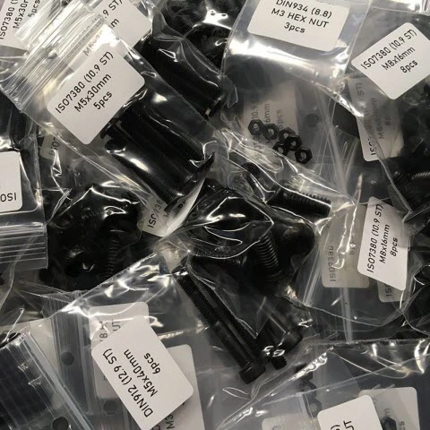
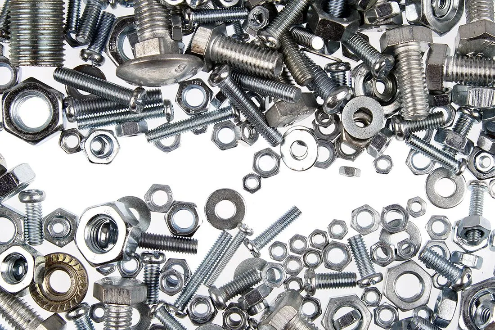

# Fasteners

[Lecktor.com](https://lecktor.com/en/)  Did a shipping calculation to see if the cost was reasonable considering the location of shipment and together with good prices an availability, I would say this is a viable option! Nearly all the screws an nuts in a kit package.

[Voron 2.4 Kit](Voron%202.4)  [Switchwire Kit](/Build%20Resources/Fasteners/Voron%20Switchwire) 

