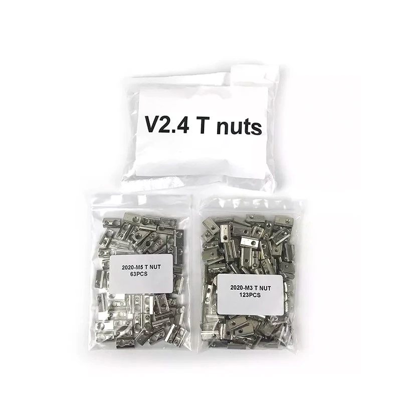
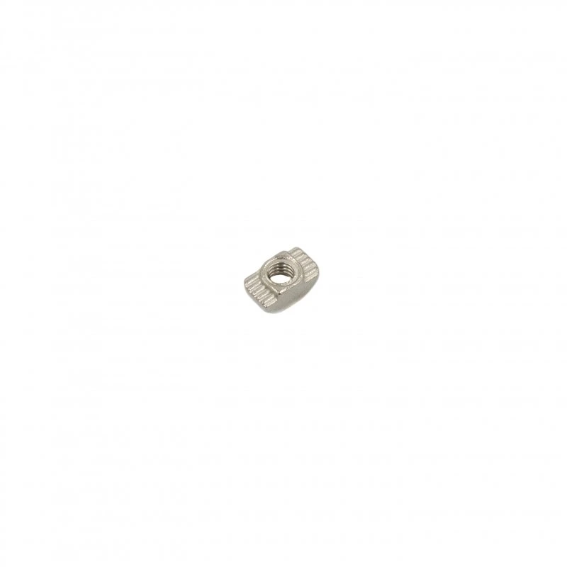

# Lecktor.com Hardware Kit  

## Voron V2.4 Hardware Kit (Black)
[Voron V2.4 Hardware Kit (Black)](https://lecktor.com/en/v2x-fasteners/488-voron-v24-hardware-kit-black-00488.html)  €38.29

Kit Contents  
Screws
  * DIN912 M5x40 screw (12.9 hardened steel) - 25pcs
  * ISO 7380-1 M5x30 screw (10.9 hardened steel) - 22pcs
  * ISO 7380-1 M5x16 screw (10.9 hardened steel) - 35pcs
  * ISO 7380-1 M5x10 screw (10.9 hardened steel) - 40pcs
  * ISO 7380-1 M4x6 screw (10.9 hardened steel) - 4pcs
  * DIN912 M3x40 screw (12.9 hardened steel) - 30pcs
  * DIN912 M3x30 screw (12.9 hardened steel) - 32pcs
  * DIN912 M3x20 screw (12.9 hardened steel) - 29pcs
  * DIN912 M3x16 screw (12.9 hardened steel) - 20pcs
  * DIN912 M3x12 screw (12.9 hardened steel) - 41pcs
  * DIN912 M3x8 screw (12.9 hardened steel) - 217pcs
  * ISO 7380-1 M3x6 screw (10.9 hardened steel) - 12pcs
  * ISO 10642 M3x6 screw (10.9 hardened steel) - 8pcs
  * ISO 10642 M3x10 screw (10.9 hardened steel) - 4pcs
  * Self tapping screw M2x10 (blackened steel) - 16pcs

Spacers and nuts
  * DIN934 M3 nut (8.8 low carbon boron steel) - 7pcs
  * DIN934 M5 nut (8.8 low carbon boron steel) - 26pcs
  * Threaded inserts (M3x5x4) - 110pcs
  * Shim ring (5x10x1.0mm) - 42pcs
  * DIN466 M4 knurled nut (blackened steel) - 4pcs
  * DIN125 M3 washer (8.8 low carbon boron steel) - 3pcs

Spares
  * DIN988 Shim ring (5x10x1.0mm) - 5pcs
  * DIN934 M5 nut (8.8 low carbon boron steel) - 4pcs
  * Threaded insert M3x4x5 (brass) - 5pcs
  * DIN912 M5x40 screw (12.9 hardened steel) - 2pcs
  * ISO 7380-1 M4x6 screw (10.9 hardened steel) - 4pcs
  * ISO 7380-1 M5x30 screw (10.9 hardened steel) - 2pcs
  * ISO 7380-1 M5x16 screw (10.9 hardened steel) - 2pcs
  * ISO 7380-1 M5x10 screw (10.9 hardened steel) - 4pcs
  * DIN912 M3x40 screw (12.9 hardened steel) - 2pcs
  * DIN912 M3x30 screw (12.9 hardened steel) - 2pcs
  * DIN912 M3x20 screw (12.9 hardened steel) - 2pcs
  * DIN912 M3x12 screw (12.9 hardened steel) - 2pcs
  * DIN912 M3x8 screw (12.9 hardened steel) - 5pcs
  * Self tapping screw M2x10 (blacked steel) - 5pcs

Tools
  * DIN911 Hex key h1.5 - 1pcs
  * DIN911 Hex key h2.0 - 1pcs
  * DIN911 Hex key h3.0 - 1pcs
  * DIN911 Hex key h4.0 - 1pcs

Additionally V2.4 build will require following parts:
  * Hammer head M3 T-nut - 47pcs
  * HNTAJ5-3 nut - 120pcs
  * HNTAJ5-5 nut - 61pcs

Note! These T-nuts are not included in the kit. see below

## Voron V2.4 T-nuts
[Voron V2.4 T-nuts](https://lecktor.com/en/v2x-fasteners/785-voron-v24-t-nuts.html)  €33.29

### Kit contents
* HNTAJ5-3 nut - 123pcs
* HNTAJ5-5 nut - 63pcs

## Hammer head M3 nuts (50 pcs)
[Hammer head M3 nuts ](https://lecktor.com/en/nuts/265-hammer-head-m3-nuts-50-pcs-00265.html)   €5.79

