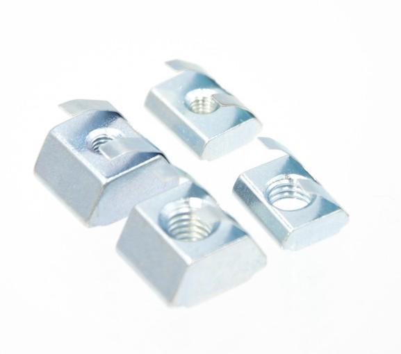

# Lecktor.com Hardware Kit  
## Voron Switchwire  
[Voron SW Hardware Kit (Black)](https://lecktor.com/en/voron-sw/489-voron-sw-hardware-kit-black.html ) <s> €39.95</s> - €29.96 
 
  
Screws
  * ISO 7380-1 M8x16 screw (10.9 hardened steel) - 8pcs
  * DIN912 M5x40 screw (12.9 hardened steel) - 6pcs
  * ISO 7380-1 M5x30 screw (10.9 hardened steel) - 5pcs
  * ISO 7380-1 M5x16 screw (10.9 hardened steel) - 12pcs
  * ISO 7380-1 M5x10 screw (10.9 hardened steel) - 50pcs
  * ISO 7380-1 M4x8 screw (10.9 hardened steel) - 4pcs
  * DIN912 M3x40 screw (12.9 hardened steel) - 7pcs
  * DIN912 M3x30 screw (12.9 hardened steel) - 28pcs
  * DIN912 M3x25 screw (12.9 hardened steel) - 2pcs
  * DIN912 M3x20 screw (12.9 hardened steel) - 3pcs
  * DIN912 M3x16 screw (12.9 hardened steel) - 12pcs
  * DIN912 M3x12 screw (12.9 hardened steel) - 12pcs
  * DIN912 M3x8 screw (12.9 hardened steel) - 66pcs
  * ISO 7380-1 M3x6 screw (10.9 hardened steel) - 6pcs
  * ISO 10642 M3x6 screw (10.9 hardened steel) - 16pcs
  * ISO 10642 M3x12 screw (10.9 hardened steel) - 9pcs
  * Self tapping screw M2x10 (blackened steel) - 8pcs

Spacers and nuts
  * DIN934 M3 nut (8.8 low carbon boron steel) - 3pcs
  * Threaded inserts (M3x5x4) - 54pcs
  * Shim ring (5x10x1.0mm) - 19pcs
  * Heater spacers (6x6x3mm) - 9pcs

Spare parts
  * DIN934 M3 nut (8.8 low carbon boron steel) - 2pcs
  * Threaded inserts (M3x5x4) - 5pcs
  * Shim ring (5x10x1.0mm) - 2pcs
  * ISO 7380-1 M8x16 screw (10.9 hardened steel) - 1pcs
  * ISO 7380-1 M5x10 screw (10.9 hardened steel) - 5pcs
  * DIN912 M3x30 screw (12.9 hardened steel) - 2pcs
  * DIN912 M3x8 screw (12.9 hardened steel) - 5pcs
  * Self tapping screw M2x10 (blackened steel) - 5pcs

Additionally SW build will require following parts:
  * Voron SW T-Nuts as a kit
or separately:
  * HNTAJ5-3 nut - 13pcs
  * HNTAJ5-5 nut - 12pcs
  * HNTAJ6-3 nut - 12pcs
  * HNTAJ6-5 nut - 52pcs

Note! These T-nuts are not included in the kit. see below

## Voron SW T-Nuts
[Voron SW T-nut Kit ](https://lecktor.com/en/nuts/692-voron-sw-t-nuts.html) <s>€49.95</s> - €37.46 

### Kit contents
* HNTAJ5-3 nut - 13pcs
* HNTAJ5-5 nut - 12pcs
* HNTAJ6-3 nut - 12pcs
* HNTAJ6-5 nut - 52pcs
