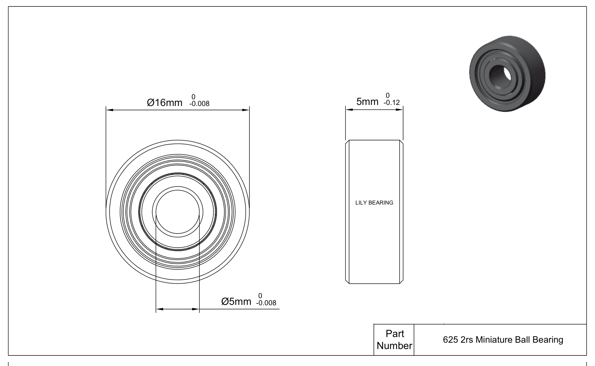

## Design Features of 625 2rs Bearing
Designed to deliver reliable and efficient performance in tight spaces, 625 2rs Bearing is an excellent choice for industrial applications with limited space. 625 2rs bore dia is 5 mm. Its out dia is 16 mm. 625 2rs ball material is 52100 Chrome Steel. Its seal type is Sealed. With high-speed capabilities, low friction, and reduced noise levels, this bearing provides optimal performance. It meets industry standards for precision and durability, making it suitable for various applications in different industries requiring compact-space solutions.

 

**Design Features**
- Model: 625 2RS
- Inner diameter: 5mm
- Outer diameter: 16mm
- Width: 5mm
- Accuracy Class: ABEC-7
- Bearing Type: Ball Bearing
- Bearing Material GCr15 Bearing Steel
- Ball Material: GCr15 Bearing Steel
- Seal Type: Rubber Seal Cover
- Lubrication: Grease
- Magnetic: little
- Hardness: 58HRC
- Clearance: C0
- Dynamic Load Rating (Cr) (Newtons): 1470
- Static Load Rating (Cor) (Newtons): 540
- Weight: 5.1 g

 

 
