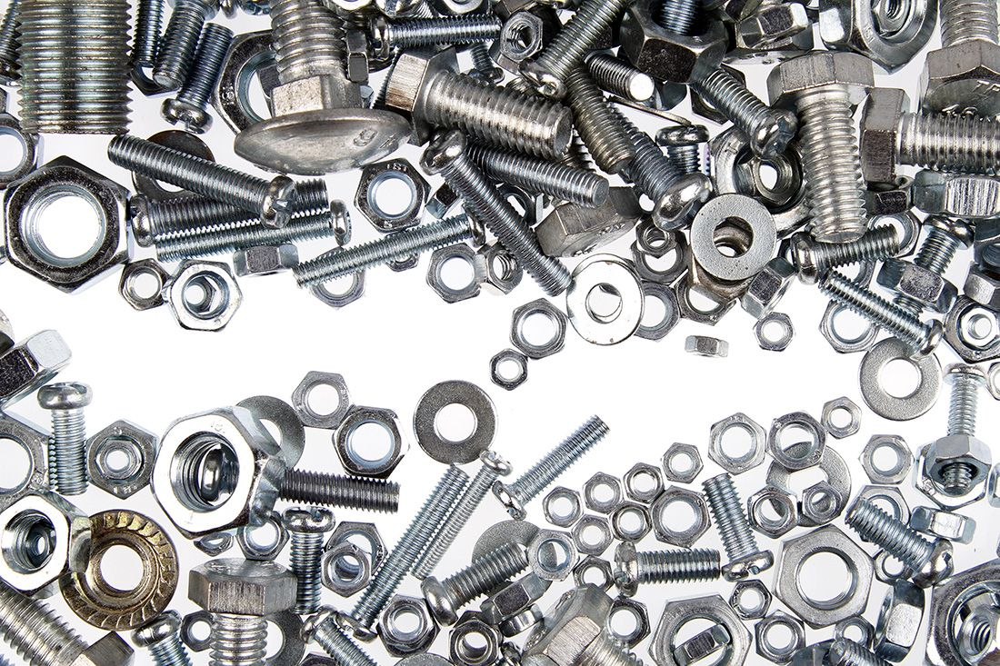

## Build Resources Guide
There are times where quality overrides price.
And are times where it will be more economical to buy a larger quantity of an item. Spare parts can be beneficial at times. 
Things like Bearings and motors need to come from quality suppliers. Machines that are not working produce nothing and no money! Make compromises accordingly...

**Fasteners**

[**Bolt Depot**](https://www.boltdepot.com/)

[**McMaster Carr**](https://www.mcmaster.com/)
