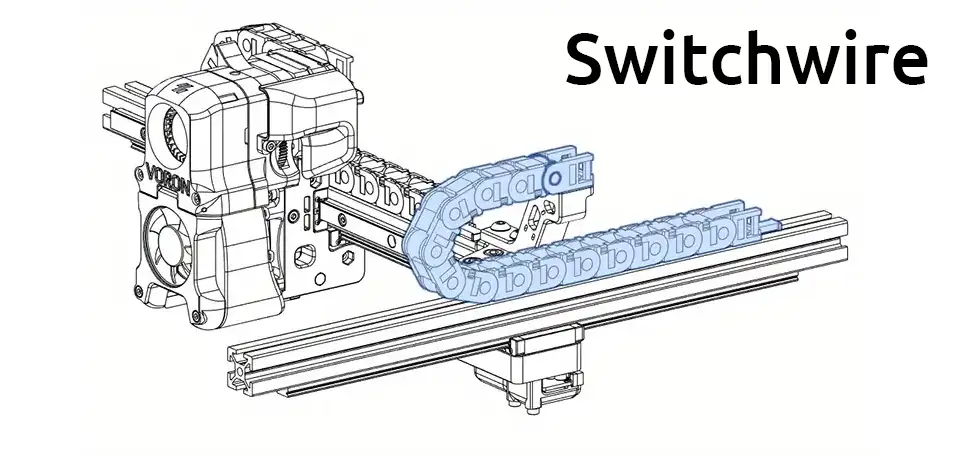

# Voron 3D Printer Specs

| Model Name | Build Volume | Frame Dimensions  WxDxH | Print Speed | Pros/Cons |
|------------|--------------|------------|-------------|--------------|
| Voron 0.2 |  120 mm³ | 250 x 360 x 365 | 250mm/s | Small cost/footprint  Limited print size |
| Trident | 250 x 250 x 250mm 300 x 300 x 250mm 350 x 350 x 250mm | - | 300mm/s |About half price of V2 Limited Z height |
| Voron 2 | 250 mm³   300 mm³   350 mm³  | 410 x 410 x 515  460 x 460 x 565  510 x 510 x 615 | 300mm/s | Large print capacity  Higher price/footprint |
| Switchwire | 250 x 210 x 240mm | 360 x 520 x 490 | 150 mm/s  | - |
