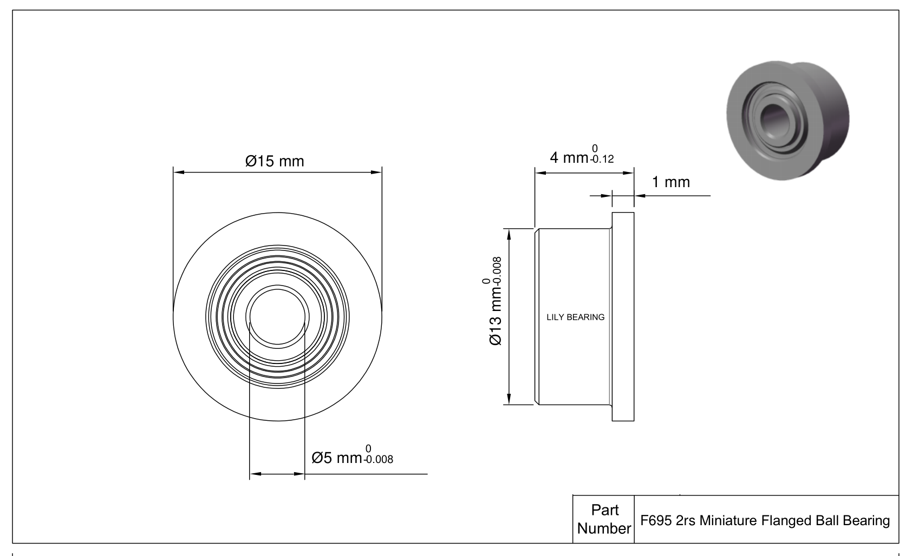

**
- Model: F695 2RS
- Accuracy Class: ABEC-7
- Bearing Type: Flange Ball Bearing
- Bearing Material GCr15 Bearing Steel
- Ball Material: GCr15 Bearing Steel
- Seal Type: Rubber Seal Cover
- Shaft diameter: 5mm
- Inner diameter (d): 5mm
- Seat hole: 13mm
- Outer diameter (D): 13mm
- Width (B): 4mm
- Flange OD: 15mm
- Flange thickness: 1mm
**

**
- Dynamic load (Cr) (N): 916
- Static load (Cor) (N): 346
- Limiting speed (oil) (X1000 RPM): 46
- Speed limit (oil) (X1000 RPM): 52
- Clearance level: C0
- Number of balls: 8
- Weight: 2.65g

Design Features of F695 2rs Bearing

F695 2rs Bearing is engineered with an outer flange that serves to locate the bearing in a housing or offer additional support to the bearing. This unique design enables trouble-free installation and dependable performance in restricted areas. The flange also helps to maintain bearing alignment and protects against axial loads. F695 2rs bore dia is 5 mm. Its out dia is 13 mm. F695 2rs ball material is 52100 Chrome Steel. Its seal type is Sealed. Designed to deliver exceptional performance and reliability in precision applications, This bearing is engineered to meet demanding requirements.

 